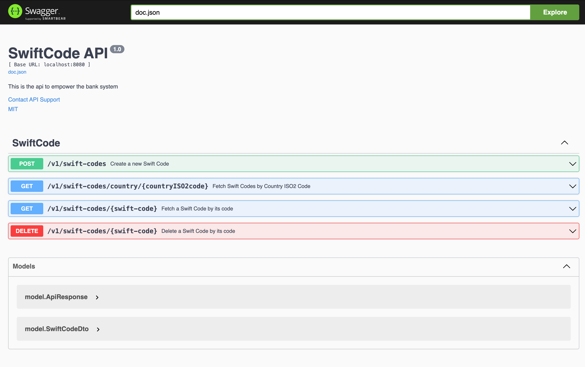
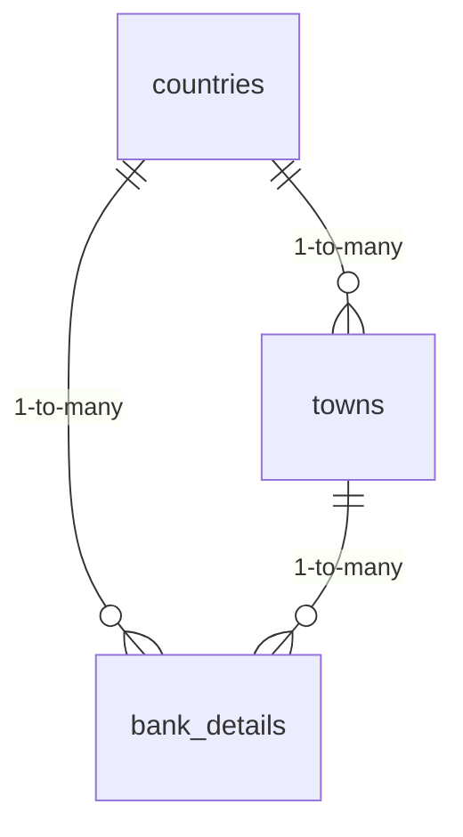

# Swift Code Management System

**Author**: Swan Htet Aung Phyo 

## Run
    
- Clone this repo with 

        git clone https://github.com/SwanHtetAungPhyo/SwiftCode.git

- Makefile Run in the Project root dir 

        make compose up 

## API documentation 


## Solution Overview

- **CSV Analysis & Parsing**:
  - Developed a CSV parser to process and clean data
  - Handled missing values by omitting empty address fields
  - Transformed raw data into database-ready format

- **Architecture**:
  - Layer-based design with separation of concerns:
    - **API Layer**: Handles HTTP requests/responses
    - **Service Layer**: Contains business logic
    - **Repository Layer**: Manages database CRUD operations
  - Implemented dependency injection pattern
  - Utilized Go interfaces for loose coupling

- **Resilience Features**:
  - Database connection retry mechanism
  - Configuration-based development
  - Proper error handling and logging

## Tech Stack

- **Language**: Go
- **Web Framework**: Gin (for built-in request logging)
- **ORM**: GORM
- **Database**: PostgreSQL
- **Environment**: Docker

## Database Design

### ER Diagram


### Schema Definition
```sql
CREATE TABLE countries (
    id INT PRIMARY KEY,
    country_iso2_code VARCHAR(2),
    name VARCHAR(255),
    time_zone VARCHAR(255)
);

CREATE TABLE towns (
    id INT PRIMARY KEY,
    name VARCHAR(255),
    country_id INT,
    CONSTRAINT fk_towns_countries
        FOREIGN KEY (country_id) 
        REFERENCES countries(id)
        ON DELETE CASCADE
        ON UPDATE CASCADE
);

CREATE TABLE bank_details (
    id INT PRIMARY KEY,
    name VARCHAR(255) NOT NULL,
    address VARCHAR(255),
    swift_code VARCHAR(11),
    is_headquarter BOOLEAN,
    country_id INT,
    town_name_id INT,
    CONSTRAINT fk_bank_details_countries
        FOREIGN KEY (country_id)
        REFERENCES countries(id)
        ON DELETE SET NULL
        ON UPDATE CASCADE,
    CONSTRAINT fk_bank_details_towns
        FOREIGN KEY (town_name_id)
        REFERENCES towns(id)
        ON DELETE SET NULL
        ON UPDATE CASCADE
);
```

### Key Features
- **Normalization**:
    - Achieved 3NF (Third Normal Form)
    - Eliminated transitive dependencies
    - Reduced data redundancy

- **Relationships**:
    - `countries` ➔ `towns` (1-to-many)
    - `countries` ➔ `bank_details` (1-to-many)
    - `towns` ➔ `bank_details` (1-to-many)

- **Constraints**:
    - Foreign key constraints with cascade operations
    - Unique constraints on critical fields
    - Proper null handling

## Benefits
✅ **Scalability**: Easily add new countries/banks without schema changes  
✅ **Maintainability**: Independent updates to country/bank data  
✅ **Data Integrity**: Referential integrity through FK constraints  
✅ **Performance**: Optimized indexes and query patterns

## System Characteristics
- **Resilient**: Automatic database connection recovery
- **Configurable**: Environment-based settings
- **Observable**: Built-in request logging via Gin
- **Maintainable**: Clear separation of concerns

```
