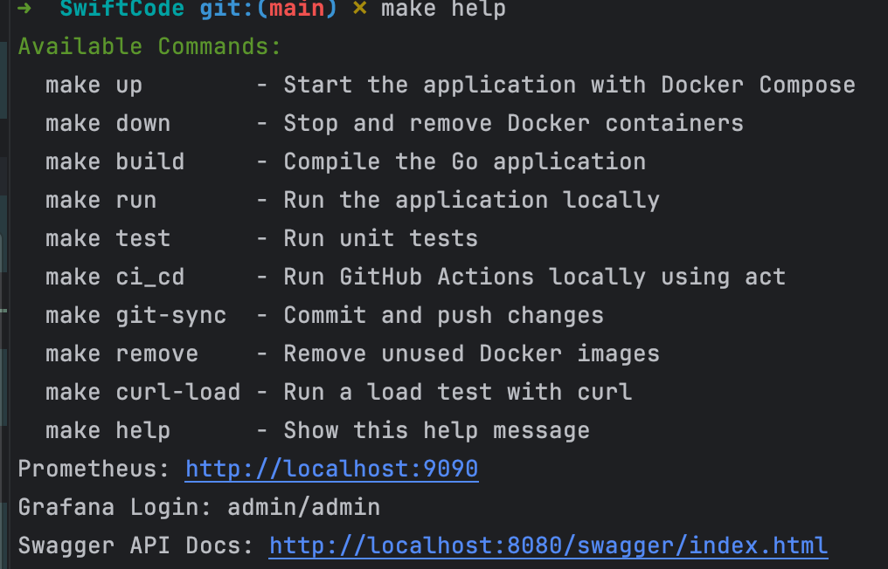

---

# Swift Code Management System

**Author**: Swan Htet Aung Phyo

---

## Run

### Clone the Repository

```bash
git clone https://github.com/SwanHtetAungPhyo/SwiftCode.git
```

### Run the Application

Use the Makefile in the project root directory:

```bash
make up       ## To run the application 
make test     ## To run the test 
make down     ## To bring down the docker compose

## If you have Go installed locally, please view the documentation of the code
pkgsite -http=:6060
```

### Instruction to Run the Application



---

## API Documentation


---

## Solution Overview

### CSV Analysis & Parsing

- Developed a **CSV parser** to process and clean data.
- Handled missing values by omitting empty address fields.
- Transformed raw data into a database-ready format.

### Architecture

- **Layer-based Design** with Separation of Concerns:
  - **API Layer**: Handles HTTP requests/responses.
  - **Service Layer**: Contains business logic.
  - **Repository Layer**: Manages database CRUD operations.
- Implemented **dependency injection**.
- Utilized **Go interfaces** for loose coupling.

### Schema
- Schema can be viewed in the `schema.sql`.

---

## API Call with cURL

All of the test calls are provided with `cURL` commands and `.http` format files. Please view them in the `/http_curl` folder.

### Resilience Features

- **Database connection retry mechanism**.
- **Configuration-based development**.
- **Proper error handling and logging**.

---

## API Routes and Solution

### Create Method:
- If the user inputs a new Swift Code with a country that does not exist in the database, the response notifies the user to input the new country first.

  _Note: Due to schema normalization, a foreign key is required._

---

## Testing

- I wrote the test cases based on my experience.
- I use the **testcontainer** approach for testing.

---

## Tech Stack

- **Language**: Go
- **Web Framework**: Gin (with built-in request logging)
- **ORM**: GORM
- **Database**: PostgreSQL
- **Environment**: Docker

---

## Database Design

### ER Diagram


### Schema Definition

```sql
CREATE TABLE countries (
                           id BIGSERIAL PRIMARY KEY,
                           country_iso2_code VARCHAR(2) UNIQUE NOT NULL,
                           name TEXT UNIQUE NOT NULL,
                           time_zone TEXT,
                           created_at TIMESTAMPTZ DEFAULT now(),
                           updated_at TIMESTAMPTZ DEFAULT now()
);


CREATE TABLE towns (
                       id BIGSERIAL PRIMARY KEY,
                       name TEXT NOT NULL,
                       country_id BIGINT NOT NULL,
                       created_at TIMESTAMPTZ DEFAULT now(),
                       updated_at TIMESTAMPTZ DEFAULT now(),
                       CONSTRAINT fk_towns_country FOREIGN KEY (country_id) REFERENCES countries(id) ON DELETE CASCADE
);
CREATE INDEX idx_towns_country_id ON towns(country_id);

CREATE TABLE swiftcodes (
                            id BIGSERIAL PRIMARY KEY,
                            name TEXT NOT NULL,
                            address TEXT,
                            swift_code VARCHAR(11) UNIQUE NOT NULL,
                            is_headquarter BOOLEAN DEFAULT FALSE,
                            country_id BIGINT NOT NULL,
                            town_name_id BIGINT NOT NULL,
                            code_type TEXT,
                            created_at TIMESTAMPTZ DEFAULT now(),
                            updated_at TIMESTAMPTZ DEFAULT now(),
                            CONSTRAINT fk_swiftcodes_country FOREIGN KEY (country_id) REFERENCES countries(id) ON DELETE CASCADE,
                            CONSTRAINT fk_swiftcodes_town FOREIGN KEY (town_name_id) REFERENCES towns(id) ON DELETE CASCADE
);
CREATE INDEX idx_swiftcodes_country_id ON swiftcodes(country_id);
CREATE INDEX idx_swiftcodes_town_name_id ON swiftcodes(town_name_id);
```

---

## Key Features

### Normalization

- Achieved **3NF (Third Normal Form)**.
- Eliminated **transitive dependencies**.
- Reduced **data redundancy**.

### Relationships

- `countries` ➔ `towns` (1-to-many)
- `countries` ➔ `bank_details` (1-to-many)
- `towns` ➔ `bank_details` (1-to-many)

### Constraints

- **Foreign key constraints** with cascade operations.
- **Unique constraints** on critical fields.
- **Proper null handling**.

---

## Benefits

- **Scalability**: Easily add new countries/banks without schema changes.
- **Maintainability**: Independent updates to country/bank data.
- **Data Integrity**: Referential integrity through foreign key constraints.
- **Performance**: Optimized indexes and query patterns.

---

## System Characteristics

- **Resilient**: Automatic database connection recovery.
- **Configurable**: Environment-based settings.
- **Observable**: Built-in request logging via Gin.
- **Maintainable**: Clear separation of concerns.

---

## Key Directories Explained

### Core Application

- **`cmd/`**  
  Main application entry point.

- **`internal/`**  
  Private application code:
  - `config/`: Configuration loading.
  - `handler/`: HTTP handlers.
  - `model/`: Data structures.
  - `services/`: Business logic.

### Infrastructure

- **`repo/`**  
  Database interactions.

- **`middleware/`**  
  HTTP middleware.

- **`routes/`**  
  API endpoint definitions.

### Testing

- **`swiftcode_test/`**  
  Unit and integration tests.

- **`mocks/`**  
  Test doubles.

- **`loadTest/`**  
  Performance tests.

### Supporting Files

- **`data/`**  
  CSV data source.

- **`pkg/`**  
  Reusable packages.

- **`docs/`**  
  API documentation.

### Configuration

- **`Dockerfile`**  
  Container definition.

- **`docker-compose.yml`**  
  Service orchestration.

- **`prometheus.yml`**  
  Monitoring setup.

---

## Load Testing

### Overview

This API includes two GET routes. Load and concurrent requests were tested using **Prometheus** for monitoring and **Grafana** for visualization.

### Prometheus UI

Access via: [http://localhost:9090/targets](http://localhost:9090/targets)


### Grafana Results

This is the result in Grafana after load testing with up to 10,000 concurrent requests using `curl`:


---
